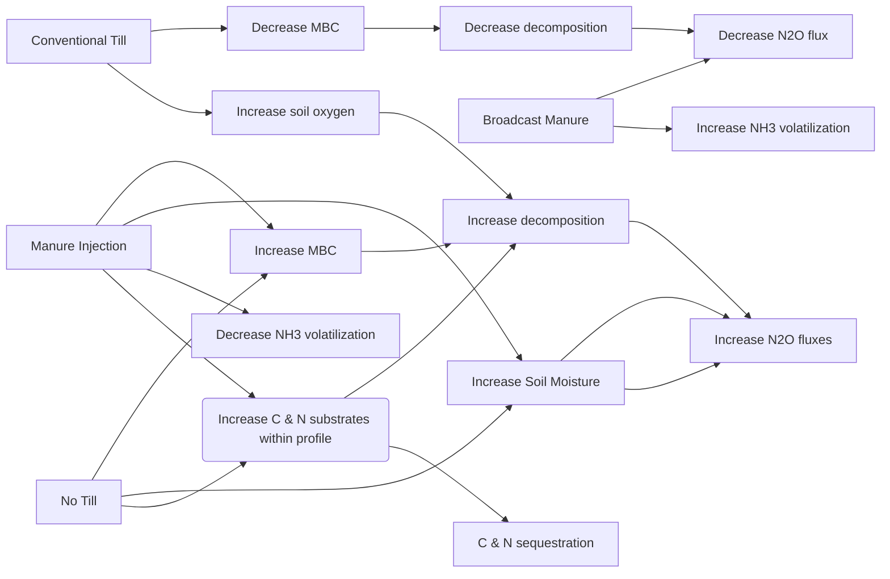

```mermaid
graph LR
A[Manure Injection]--> J(Increase C & N substrates within profile)
A[Manure Injection]--> M[Decrease NH3 volatilization]
A[Manure Injection]--> E[Increase Soil Moisture]
A[Manure Injection]--> G[Increase MBC]
B[Broadcast Manure]--> N[Increase NH3 volatilization]
B[Broadcast Manure]--> O[Decrease N2O flux]
C[No Till]--> J(Increase C & N substrates within profile)
C[No Till]--> E[Increase Soil Moisture]
C[No Till]--> G[Increase MBC]
D[Conventional Till]--> F[Increase soil oxygen]
D[Conventional Till]--> H[Decrease MBC]
E[Increase Soil Moisture]--> P[Increase N2O fluxes]
G[Increase MBC]--> L[Increase decomposition]
F[Increase soil oxygen]--> L[Increase decomposition]
H[Decrease MBC]--> K[Decrease decomposition]
L[Increase decomposition]--> P[Increase N2O fluxes]
K[Decrease decomposition]--> O[Decrease N2O flux]
E[Increase Soil Moisture]--> P[Increase N2O fluxes]
J(Increase C & N substrates within profile)--> Q[C & N sequestration]
J(Increase C & N substrates within profile)--> L[Increase decomposition]


```

