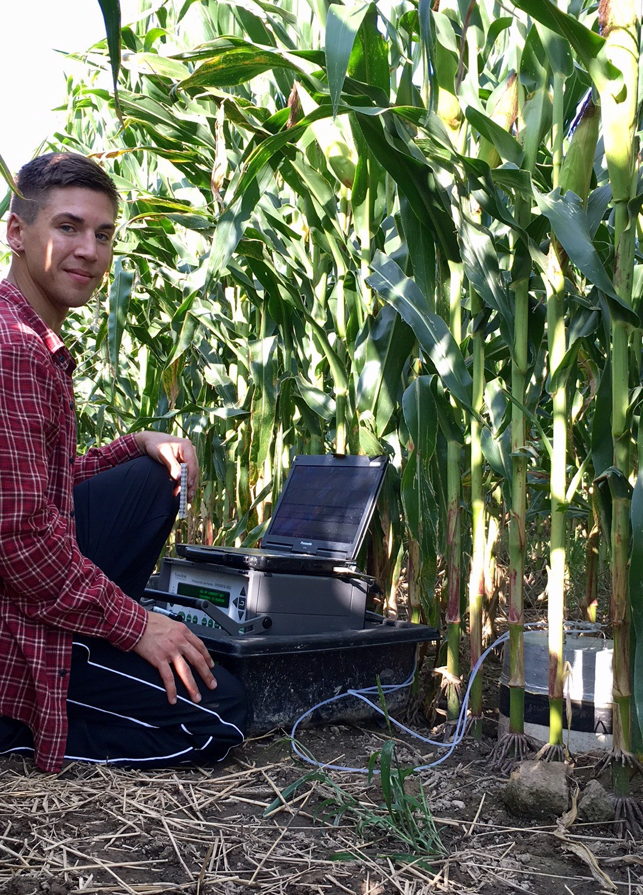

## Computational Biology Blog

I'm a first year Masters student studying agricultural biogeochemsitry. My research focuses on utilizing a combination of best management practices (i.e., tillage, manure application/timing, and incorporating cover crops during the off season) in order to mitigate nutrient losses via greenhouse gas emissions, improve soil fertility, and increase crop yield. 

#Homework Assignements
####01/24/18
[Flowchart](TheisFlowChartBetter.png) 

[Predicted Fluxes](PredictedFluxes.pdf)

####01/31/18
[Beamer Presentation](FirstBeamerPresentation.pdf)

 